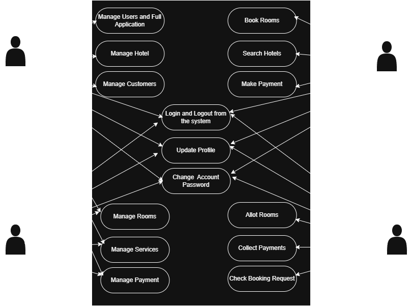

# Requirement Analysis in Software Development

## Introduction

This repository serves as a foundational guide to the process of **Requirement Analysis** in software development. Requirement analysis is a crucial phase of the Software Development Life Cycle (SDLC), where stakeholders define, gather, analyze, and document the functional and non-functional requirements of a system.

By providing clear and structured insights—including user stories, use cases, and acceptance criteria—this repository helps ensure that software projects are aligned with user expectations and business goals. It is especially relevant for projects such as the Lagos Intranet or booking systems, where thorough analysis is key to success.

Topics covered include:
- Requirement Gathering and Elicitation
- Documentation and Modeling
- Functional and Non-functional Requirements
- Use Case Diagrams
- Acceptance Criteria

---

## What is Requirement Analysis?

Requirement Analysis is a fundamental phase in the Software Development Life Cycle (SDLC) that involves identifying, documenting, and managing the needs and expectations of stakeholders for a software product. This process ensures that developers and clients share a clear understanding of what the software should do and how it should perform.

### Importance of Requirement Analysis:

- **Clarity and Understanding**: It helps eliminate ambiguity by defining detailed system functionalities and expectations, fostering better communication between stakeholders and developers.
- **Scope Definition**: Establishes the boundaries of the project, which helps prevent scope creep and uncontrolled changes during development.
- **Foundation for Design and Development**: Serves as the blueprint for system design, architecture, and implementation.
- **Accurate Cost and Time Estimates**: Enables realistic planning by providing clear requirements that influence budgeting and scheduling.
- **Improved Quality Assurance**: Aligns development efforts with user needs, resulting in a higher quality end product that satisfies stakeholder requirements.
- **Risk Reduction**: Identifies potential technical and business risks early in the project, allowing for mitigation strategies.

---

## Why is Requirement Analysis Important?

Requirement Analysis plays a pivotal role in the success of any software project. Without clearly defined and understood requirements, development teams risk building a system that does not meet the needs of its users or stakeholders. Here are three key reasons why Requirement Analysis is critical in the Software Development Life Cycle (SDLC):

### 1. **Clear Communication and Understanding**
Requirement analysis ensures that all stakeholders—developers, clients, users, and project managers—share a mutual understanding of the system's purpose and functionalities.

### 2. **Accurate Planning and Estimation**
Well-defined requirements provide a solid foundation for estimating the time, budget, and resources needed for a project.

### 3. **Improved Product Quality**
Capturing detailed user needs early helps ensure the final product aligns with stakeholder goals and performs as expected.

---

## Key Activities in Requirement Analysis

Requirement Analysis involves several structured activities that ensure all stakeholder needs are thoroughly understood, documented, and validated. The five key activities are:

- **Requirement Gathering**
  - Interviews, surveys, workshops, and observations.

- **Requirement Elicitation**
  - Brainstorming, focus groups, and prototyping.

- **Requirement Documentation**
  - Specification documents, user stories, and use cases.

- **Requirement Analysis and Modeling**
  - Prioritization, feasibility analysis, and diagram modeling.

- **Requirement Validation**
  - Review, acceptance criteria, and traceability.

---

## Types of Requirements

In software development, requirements are broadly categorized into two types: **Functional Requirements** and **Non-functional Requirements**.

### Functional Requirements

Functional requirements define specific behaviors and features the system must support.

**Examples for a Booking System:**
- User Registration and Authentication
- Search Hotel
- Make Booking
- Cancel Booking
- Payment Processing
- Write Review

### Non-functional Requirements

Non-functional requirements specify how the system performs.

**Examples:**
- Performance: Search results load in under 2 seconds.
- Scalability: Support for 10,000 concurrent users.
- Security: Encrypted data and compliance with privacy laws.
- Availability: 99.9% system uptime.
- Usability: Intuitive interface.
- Maintainability: Modular and easy to update.

---

## Use Case Diagrams

Use Case Diagrams are visual representations of how users interact with a system. They help define system scope and improve stakeholder communication.

### Benefits:
- Clarify system functionality
- Improve requirement validation
- Support test case development

### Hotel Booking System Use Case Diagram:

**Actors**:
- Guest
- Admin
- Hotel Manager

**Use Cases**:
- Register, Login, Search Hotel, Make Booking, Cancel Booking, Write Review (Guest)
- Manage Users, Generate Reports (Admin)
- Manage Hotel Details, Confirm Booking, View Reviews (Hotel Manager)

---

## Acceptance Criteria

Acceptance Criteria are conditions a feature must meet to be accepted.

### Importance:
- Clarifies feature expectations
- Guides development and testing
- Defines “done” in Agile environments

### Example: Checkout Feature

**Acceptance Criteria**:
1. User can review booking summary before payment.
2. Payment options include credit card and PayPal.
3. Confirmation appears after successful payment.
4. Confirmation email is sent to the user.
5. Booking is stored in user history.
6. Errors are shown for failed transactions with retry option.
